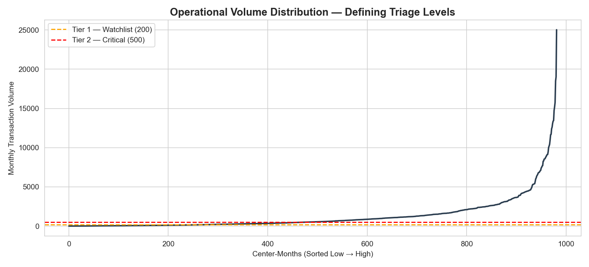
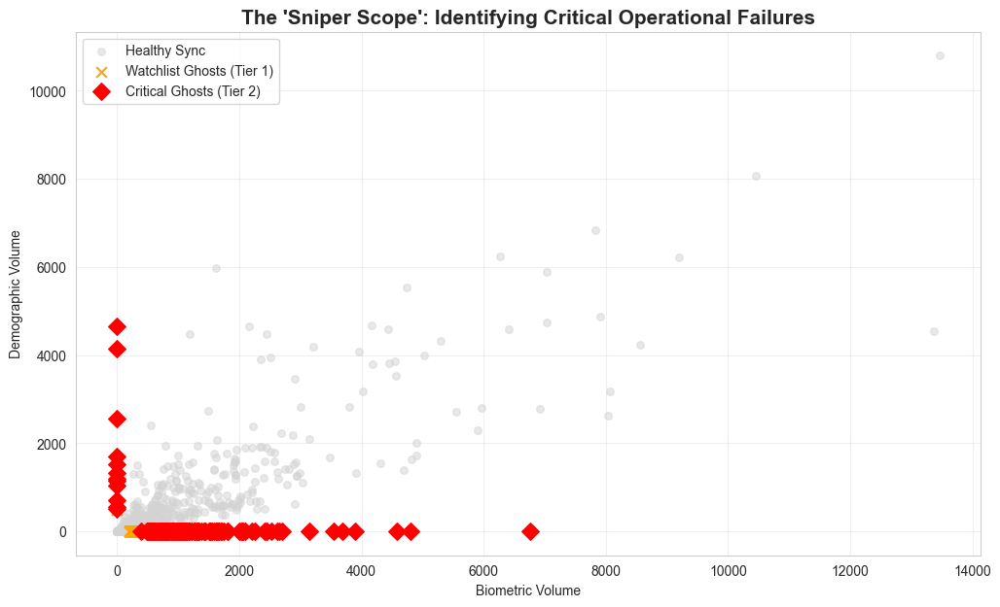
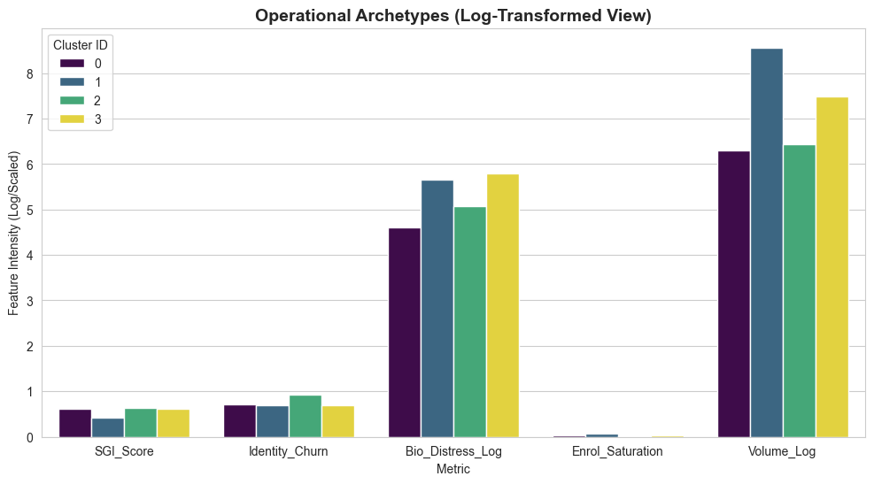
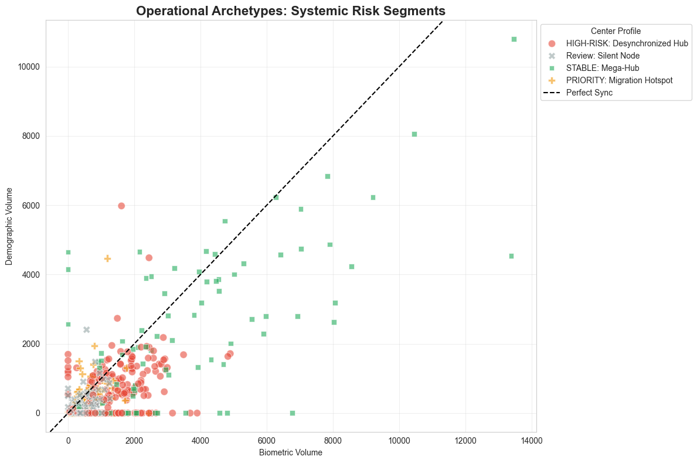

# 🛡️ UIDAI Aadhaar Fraud Intelligence System
### Thane District — Ghost Center Detection & Operational Risk Segmentation

> **Hackathon Project** | UIDAI (Unique Identification Authority of India)  
> **Scope:** Thane District, Maharashtra | **Coverage:** 96 Pincodes | **Period:** Mar 2025 – Jan 2026

---

## 📌 Problem Statement

Aadhaar enrollment and update centers across India generate three independent data streams — **Biometric updates**, **Demographic updates**, and **New Enrollments**. In a healthy, legitimate center, these streams operate in sync. When a center is a **ghost operation** (fraudulent, non-functional, or data-pipeline broken), one or more streams go completely silent while others remain active — creating a measurable, detectable **synchronization gap**.

This project builds an end-to-end fraud intelligence pipeline that:
- Detects ghost centers using a custom anomaly score
- Segments all centers by operational archetype using unsupervised ML
- Produces a ranked, actionable audit target list for field investigators

---

## 🗂️ Project Structure

```
HACKATHON UIDAI/
│
├── data/
│   ├── raw/                                  # Original UIDAI datasets
│   │   ├── Aadhaar Biometric Monthly Update Data.csv
│   │   ├── Aadhar Demographic Updates for Thane.csv
│   │   └── Aadhar Enrollment Dataset for Thane.csv
│   │
│   └── processed/
│       └── master_aadhaar_thane.csv          # Merged master dataset
│
├── notebooks/
│   └── Analysis_Report.ipynb                 # Full analysis pipeline
│
├── scripts/
│   └── 1_create_master_dataset.py            # Data pipeline script
│
├── outputs/                                  # Generated charts & reports
│
├── final_audit_targets_confirmed.csv         # 42 high-confidence fraud targets
├── final_ghost_center_list.csv               # Complete ghost center list
├── LICENSE
└── README.md
```

---

## 📊 Dataset Overview

| Dataset | Rows | Pincodes | Period |
|---|---|---|---|
| Aadhaar Biometric Monthly Update Data | 20,196 | 96 | Mar 2025 – Jan 2026 |
| Aadhar Demographic Updates for Thane | 8,849 | 96 | Dec 2025 – Jan 2026 |
| Aadhar Enrollment Dataset for Thane | 5,064 | 94 | Dec 2025 – Jan 2026 |
| **master_aadhaar_thane.csv** (processed) | **982** | **96** | **Mar 2025 – Jan 2026** |

All raw datasets share `date`, `state`, `district`, `pincode` as common keys, aggregated monthly by pincode into the master dataset.

---

## ⚙️ Pipeline: Point 1 — Data Engineering (`1_create_master_dataset.py`)

The data pipeline standardizes and merges all three raw streams into a single analysis-ready master dataset.

**Steps:**
1. Load 3 raw CSVs from `data/raw/`
2. Parse and standardize dates to `DD-MM-YYYY` format
3. Create monthly period keys (`YYYY-MM`)
4. Aggregate each stream by `pincode` + `month`
5. Outer merge all three streams (preserving all records)
6. Fill nulls with `0`, sort by `pincode` and `month`
7. Export to `data/processed/master_aadhaar_thane.csv`

**Master Dataset Columns:**

| Column | Description |
|---|---|
| `pincode`, `month` | Primary composite key |
| `bio_child`, `bio_adult`, `bio_total` | Biometric update counts |
| `demo_child`, `demo_adult`, `demo_total` | Demographic update counts |
| `enrol_infant`, `enrol_child`, `enrol_adult`, `enrol_total` | New enrollment counts |

---

## 🔬 Analysis Pipeline: Point 2 & 3 (`Analysis_Report.ipynb`)

### Step 1 — Feature Engineering: The Metric Factory

Five custom behavioral indicators are engineered from the raw transaction data:

| Metric | Formula | What it Detects |
|---|---|---|
| `SGI_Score` (Sync Gap Index) | `abs(bio - demo) / (bio + demo + 1)` | Stream desynchronization → Ghost Centers |
| `Identity_Churn` | `(demo_adult + bio_adult) / (total_txn + 1)` | Adult identity instability |
| `Bio_Distress_Adult` | `bio_adult / (demo_adult + 1)` | Biometric-only activity without paired demo updates |
| `Child_Compliance` | `bio_child / (bio_child + demo_child + 1)` | Children's update compliance ratio |
| `Enrol_Saturation` | `enrol_total / (total_txn + 1)` | Proportion of activity that is new enrollment |

> **Key Insight:** An SGI_Score > 0.8 means one stream is processing **9x more volume** than the other — a near-impossible pattern for a legitimate, functioning center.

---

### Step 2 — Statistical Threshold Discovery

Volume quantile analysis was used to scientifically define operational tiers, avoiding arbitrary cutoffs:

| Percentile | Monthly Transactions |
|---|---|
| 25th | 148 |
| 50th (Median) | 527 |
| 75th | 1,501 |
| 90th | 3,218 |
| 95th | 5,139 |

**Operational Tiers:**

| Tier | Threshold | Coverage | Action |
|---|---|---|---|
| Tier 1 — Watchlist | > 200 txns/month | 70.6% of all center-months | Automated digital alert |
| Tier 2 — Critical | > 500 txns/month | 51.2% of all center-months | Immediate physical audit |



> The curve shows a classic power-law distribution — ~80% of centers operate below the median, while the top 5% (pincodes like 421302) process 25,000+ monthly transactions. Tier cutoffs are placed at the elbow of the distribution.

---

### Step 3 — Ghost Center Detection Engine

**Detection Logic:**
- A center is flagged as a **ghost** if its `SGI_Score > 0.8` AND it meets the volume tier threshold
- SGI_Score > 0.8 indicates one stream is effectively dead while the other runs normally

**Results:**

| Category | Count | Action |
|---|---|---|
| Critical Ghost Centers (Tier 2, > 500 txns) | **179** instances | IMMEDIATE PHYSICAL AUDIT |
| Watchlist Ghost Centers (Tier 1, 200–500 txns) | **107** instances | AUTOMATED ALERT to operator |

**Top Critical Ghost Examples:**

| Month | Pincode | Bio Total | Demo Total | SGI Score | Total Txn |
|---|---|---|---|---|---|
| 2025-08 | 421302 | 6,767 | 0 | 0.9999 | 6,767 |
| 2025-04 | 421306 | 4,576 | 0 | 0.9998 | 4,905 |
| 2025-08 | 400612 | 4,800 | 0 | 0.9998 | 4,800 |
| 2025-03 | 421302 | 0 | 4,649 | 0.9998 | 4,649 |



> Ghost centers appear **on the axes** of the Bio vs Demo scatter plot — either processing thousands of biometric records with zero demographic updates (X-axis), or vice versa (Y-axis). Healthy centers cluster along the diagonal.

---

### Step 4 — Operational Segmentation (K-Means Clustering)

Centers were aggregated to pincode level and segmented using **K-Means (k=4)** with log-transformed features to handle skewed distributions.

**Features used:** `SGI_Score`, `Identity_Churn`, `Bio_Distress_Log`, `Enrol_Saturation`, `Volume_Log`

**Cluster Archetypes:**

| Cluster | Label | Avg Volume | Avg Bio Distress | Avg Churn | Interpretation |
|---|---|---|---|---|---|
| 0 | Review: Silent Node | 597 | 107 | 0.70 | Low-volume, borderline centers |
| 1 | STABLE: Mega-Hub | 6,217 | 324 | 0.70 | Highest volume, best sync |
| 2 | PRIORITY: Migration Hotspot | 685 | 189 | **0.92** | Highest adult identity churn — population flux |
| 3 | HIGH-RISK: Desynchronized Hub | 1,884 | **347** | 0.69 | High distress + desync tendency |





> In the final scatter plot, **Mega-Hubs (green)** sit near the perfect sync diagonal, confirming legitimate high-volume operation. **HIGH-RISK hubs (red)** cluster away from the diagonal with heavy scatter, revealing systemic desynchronization.

---

### Step 5 — Final Audit Target List

A center is confirmed as a **high-confidence fraud target** only if it triggered the Critical Ghost alert in **2 or more separate months** — filtering out one-off glitches.

**Result: 42 High-Confidence Audit Targets identified**

| Rank | Pincode | Ghost Months | Category |
|---|---|---|---|
| 1 | 421201 | 6 | HIGH-RISK: Desynchronized Hub |
| 2 | 401105 | 6 | HIGH-RISK: Desynchronized Hub |
| 3 | 400709 | 6 | HIGH-RISK: Desynchronized Hub |
| 4 | 421401 | 6 | HIGH-RISK: Desynchronized Hub |
| 5 | 421004 | 5 | HIGH-RISK: Desynchronized Hub |
| ... | ... | ... | ... |

> Full list exported to `final_audit_targets_confirmed.csv`

**Breakdown of 42 targets by category:**
- HIGH-RISK: Desynchronized Hub — **24 centers**
- PRIORITY: Migration Hotspot — **10 centers**
- STABLE: Mega-Hub — **5 centers** *(high-volume centers that still showed ghost patterns in some months)*
- Review: Silent Node — **4 centers**

---

## 🚀 How to Run

### Prerequisites

```bash
pip install pandas numpy scikit-learn matplotlib seaborn jupyter
```

### Step 1: Build the Master Dataset

```bash
cd scripts/
python 1_create_master_dataset.py
```

Output: `data/processed/master_aadhaar_thane.csv`

### Step 2: Run the Analysis

```bash
cd notebooks/
jupyter notebook Analysis_Report.ipynb
```

Run all cells in order. Outputs will be generated in the `outputs/` folder.

---

## 📈 Key Results Summary

| Metric | Value |
|---|---|
| Total center-months analyzed | 982 |
| Unique pincodes covered | 96 |
| Time period | Mar 2025 – Jan 2026 (11 months) |
| Critical Ghost instances detected | 179 |
| Watchlist Ghost instances detected | 107 |
| Operational archetypes identified | 4 |
| High-confidence audit targets | **42** |
| Top repeat offender ghost months | 6 months (4 pincodes) |

---

## 🛠️ Tech Stack

| Tool | Purpose |
|---|---|
| Python 3.x | Core language |
| Pandas | Data wrangling & aggregation |
| NumPy | Numerical operations & log transforms |
| Scikit-learn | K-Means clustering, StandardScaler |
| Matplotlib / Seaborn | Visualization |
| Jupyter Notebook | Analysis & reporting |

---

## 📄 License

This project is licensed under the MIT License. See [LICENSE](LICENSE) for details.

---

## 👥 Contributors

- **nparth29** — Data Engineering, Feature Engineering, Fraud Detection, ML Segmentation

---

*Built for the UIDAI Hackathon — Strengthening Aadhaar's Integrity through Data Intelligence.*
