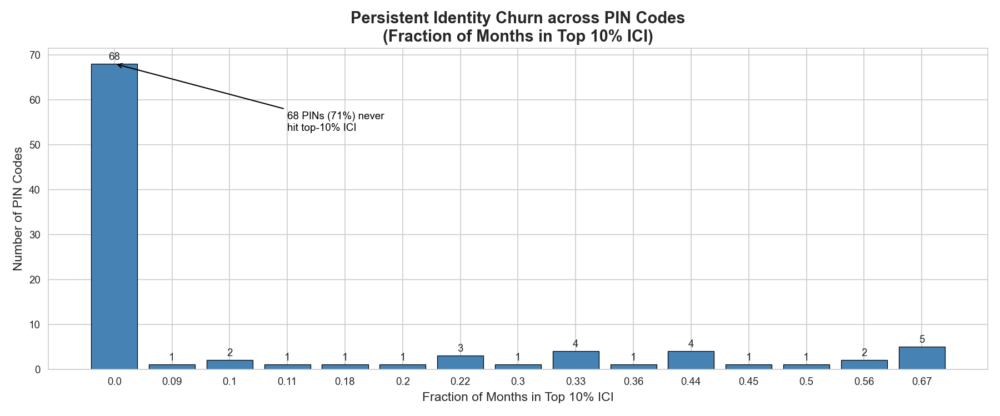
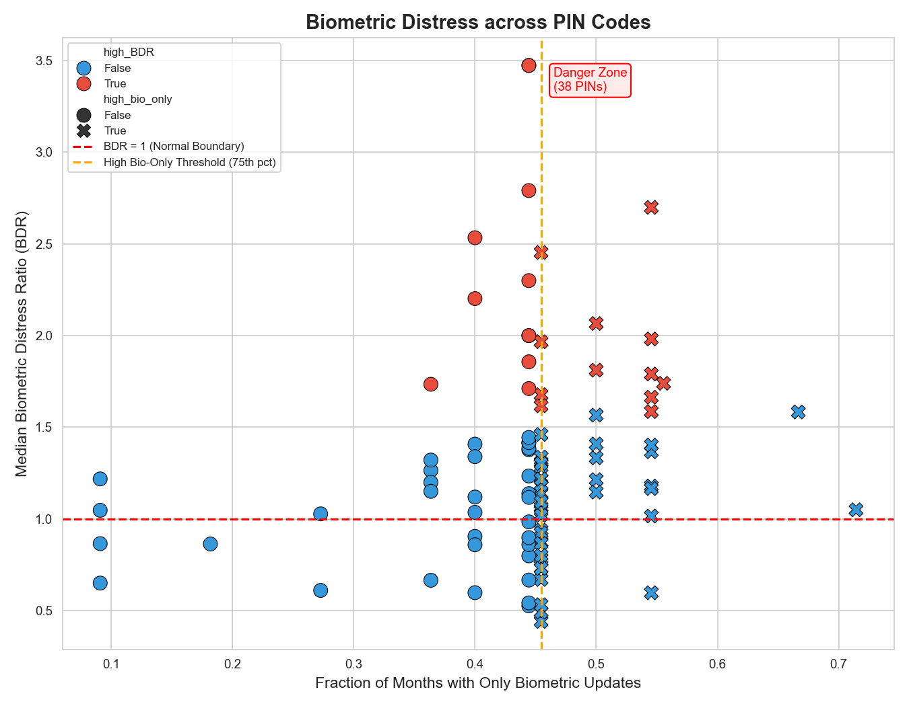
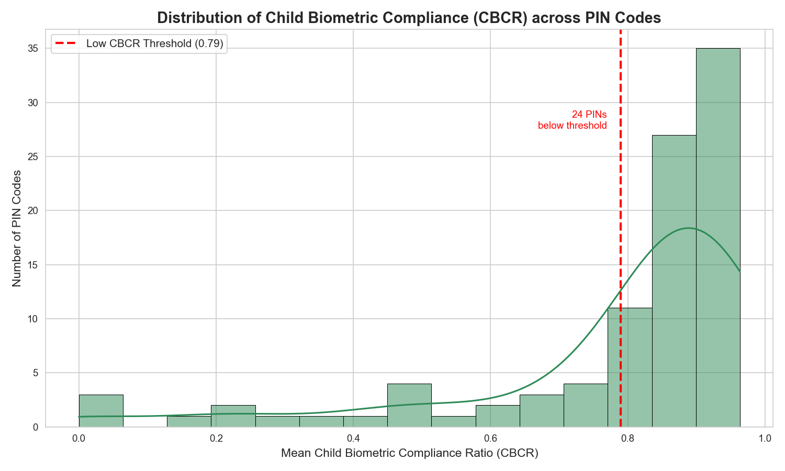
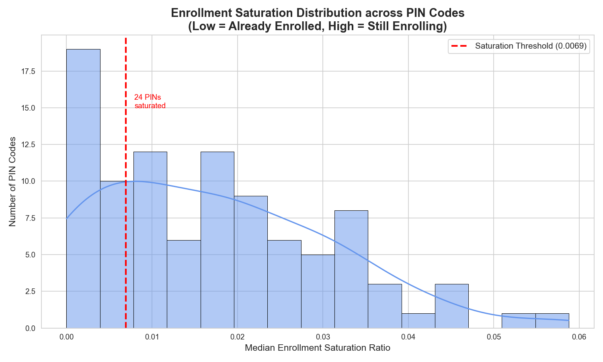
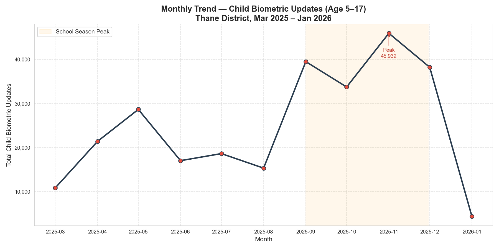

# 🛡️ UIDAI Aadhaar Fraud Intelligence System
### Thane District, Maharashtra | Mar 2025 – Jan 2026

> Detecting ghost enrollment centers and profiling operational risk across 96 pincodes
> using custom anomaly scoring, unsupervised ML, and behavioral metrics.

---

## 📌 Problem Statement

Aadhaar centers across India generate three independent data streams — **Biometric updates**,
**Demographic updates**, and **New Enrollments**. In a healthy, legitimate center, all three
streams operate in sync. A **ghost center** — fraudulent or non-functional — shows a hard
imbalance: one stream goes completely silent while others remain active.

Beyond fraud, UIDAI also needs to understand **how centers behave operationally**:
- Are adults churning their identities abnormally?
- Are children complying with mandatory biometric updates?
- Which areas still need enrollment capacity vs. which are already saturated?

This project builds a complete **data intelligence pipeline** to answer all of these questions.

---

## 🗂️ Project Structure

```
HACKATHON UIDAI/
│
├── data/
│   ├── raw/                                        # Original UIDAI datasets (never modified)
│   │   ├── Aadhaar Biometric Monthly Update Data.csv
│   │   ├── Aadhar Demographic Updates for Thane.csv
│   │   └── Aadhar Enrollment Dataset for Thane.csv
│   │
│   └── processed/
│       └── master_aadhaar_thane.csv                # Single merged master dataset
│
├── notebooks/
│   ├── 01_ghost_detection.ipynb                    # Fraud detection + K-Means segmentation
│   ├── 02_behavioral_metrics.ipynb                 # ICI, BDR, CBCR, Enrollment Saturation
│   └── 03_visualizations.ipynb                     # All operational charts
│
├── reports/                                        # Final analytical outputs
│   ├── final_audit_targets.csv                     # 42 confirmed fraud targets
│   ├── ghost_center_list.csv                       # All 179 critical ghost instances
│   └── pin_summary.csv                             # Behavioral profile of all 96 pincodes
│
├── outputs/                                        # All generated charts
│   ├── volume_distribution.png
│   ├── sniper_scope.png
│   ├── risk_segments.png
│   ├── 01_identity_churn.png
│   ├── 02_biometric_distress.png
│   ├── 03_child_compliance.png
│   ├── 04_enrol_saturation.png
│   └── 05_child_bio_trend.png
│
├── scripts/
│   └── create_master_dataset.py                    # Data pipeline script
│
├── LICENSE
└── README.md
```

---

## 📊 Dataset Overview

| Dataset | Rows | Pincodes | Period |
|---|---|---|---|
| Aadhaar Biometric Monthly Update Data | 20,196 | 96 | Mar 2025 – Jan 2026 |
| Aadhar Demographic Updates for Thane | 8,849 | 96 | Dec 2025 – Jan 2026 |
| Aadhar Enrollment Dataset for Thane | 5,064 | 94 | Dec 2025 – Jan 2026 |
| **master_aadhaar_thane.csv** (processed) | **982** | **96** | **Mar 2025 – Jan 2026** |

---

## ⚙️ How to Run

### Prerequisites

```bash
pip install pandas numpy scikit-learn matplotlib seaborn jupyter
```

### Step 1 — Build the Master Dataset

Run once from the project root. Merges all 3 raw streams into one clean monthly dataset.

```bash
python scripts/create_master_dataset.py
```

Output: `data/processed/master_aadhaar_thane.csv`

### Step 2 — Run the Notebooks in Order

```bash
cd notebooks/
jupyter notebook
```

Run in this order:
1. `01_ghost_detection.ipynb`
2. `02_behavioral_metrics.ipynb`
3. `03_visualizations.ipynb`

---

## 🔍 Pipeline Deep Dive

### Script — Data Engineering (`create_master_dataset.py`)

The pipeline loads all 3 raw CSVs, parses and standardizes dates, aggregates each
stream to monthly level per pincode, then performs a single outer merge to produce
the master dataset. Nulls are filled with 0, columns are renamed for clarity,
and stream totals are computed.

**Master dataset columns:**

| Column | Description |
|---|---|
| `pincode`, `month` | Primary composite key |
| `bio_child`, `bio_adult`, `bio_total` | Biometric update counts |
| `demo_child`, `demo_adult`, `demo_total` | Demographic update counts |
| `enrol_infant`, `enrol_child`, `enrol_adult`, `enrol_total` | New enrollment counts |

---

### Notebook 01 — Ghost Center Detection

#### Feature Engineering

Five behavioral indicators engineered from the master dataset:

| Metric | Formula | Purpose |
|---|---|---|
| `SGI_Score` | `abs(bio_total - demo_total) / (bio_total + demo_total + 1)` | Core ghost detection metric |
| `total_txn` | `bio_total + demo_total + enrol_total` | Overall center activity volume |
| `Identity_Churn` | `(demo_adult + bio_adult) / (total_txn + 1)` | Adult identity instability |
| `Bio_Distress` | `bio_adult / (demo_adult + 1)` | Biometric-only pressure |
| `Enrol_Saturation` | `enrol_total / (total_txn + 1)` | New enrollment proportion |

> **Key insight:** SGI_Score > 0.8 means one stream is processing **9x more volume**
> than the other — a near-impossible pattern for any legitimate center.

#### Statistical Threshold Discovery

| Percentile | Monthly Transactions |
|---|---|
| 25th | 148 |
| 50th (Median) | 527 |
| 75th | 1,501 |
| 90th | 3,218 |

| Tier | Threshold | Coverage | Action |
|---|---|---|---|
| Tier 1 — Watchlist | > 200 txns/month | 70.6% of center-months | Automated digital alert |
| Tier 2 — Critical | > 500 txns/month | 51.2% of center-months | Immediate physical audit |


#### Ghost Detection Results

| Category | Instances | Action |
|---|---|---|
| Critical Ghost Centers (Tier 2) | **179** | Immediate physical audit |
| Watchlist Ghost Centers (Tier 1) | **107** | Automated alert to operator |


> Ghost centers appear **on the axes** of the scatter — processing thousands of records
> in one stream with zero activity in the other.

#### K-Means Operational Segmentation (k=4)

| Cluster | Label | Avg Volume | Key Signal |
|---|---|---|---|
| 0 | Review: Silent Node | 597 | Low volume, borderline activity |
| 1 | STABLE: Mega-Hub | 6,217 | Highest volume, best stream sync |
| 2 | PRIORITY: Migration Hotspot | 685 | Highest adult identity churn |
| 3 | HIGH-RISK: Desynchronized Hub | 1,884 | High distress + desync tendency |


#### Final Audit Targets

Centers are confirmed targets only if flagged in **≥ 2 separate months** —
filtering one-off glitches from genuine patterns.

**42 confirmed audit targets identified from 96 pincodes.**

| Ghost Months | Pincodes | Top Category |
|---|---|---|
| 6 months | 4 | HIGH-RISK: Desynchronized Hub |
| 5 months | 11 | HIGH-RISK: Desynchronized Hub |
| 4 months | 12 | Mixed |
| 2–3 months | 15 | Mixed |

> Full list: `reports/final_audit_targets.csv`

---

### Notebook 02 — Behavioral Metrics

Four metrics build a comprehensive operational profile per pincode,
all exported to `reports/pin_summary.csv`.

#### ICI — Identity Churn Index
`(demo_adult + bio_adult) / (total_txn + 1)`

Persistently high ICI signals structural instability — migration pressure
or fraudulent identity cycling. 68/96 pincodes (71%) never hit the top-10%
threshold. 5 pincodes were flagged in 66%+ of their active months.



#### BDR — Biometric Distress Ratio
`bio_adult / (demo_adult + 1)`

Measures whether adult biometric updates are paired with demographic
updates (normal) or happening in complete isolation (distress signal).
**26 pincodes** fall in the danger zone — high BDR combined with high
biometric-only frequency.

| ICI | BDR | Interpretation |
|---|---|---|
| High | High | 🔴 Biometric Distress Zone |
| High | Low | 🟡 Migration / Address Churn |
| Low | High | 🟠 Isolated Biometric Problem |



#### CBCR — Child Biometric Compliance Ratio
`bio_child / (bio_child + demo_child + 1)`

Measures whether children completing Aadhaar updates also complete the
mandatory biometric component. Most pincodes are compliant (median 0.89)
but 3 pincodes show complete non-compliance (CBCR = 0.0) across all months.



#### Enrollment Saturation
`enrol_total / (total_txn + 1)`

Thane is heavily saturated — median ES of just 0.013 district-wide.
Only 10 pincodes still have significant new enrollment activity.
Guides UIDAI on where to invest in **update infrastructure vs enrollment camps**.



---

### Notebook 03 — Visualizations

All charts from Notebooks 01 and 02 are consolidated here with enhanced
annotations and a final verification cell confirming all outputs saved correctly.

**Chart 5 — Monthly Child Biometric Trend:**
Clear school-season peak in Sep–Nov 2025 (up to 46,000 updates in November),
with a sharp drop in Jan 2026. Centers need 2–3x capacity during Q3/Q4.



---

## 📈 Key Results Summary

| Metric | Value |
|---|---|
| Total center-months analyzed | 982 |
| Unique pincodes covered | 96 |
| Time period | Mar 2025 – Jan 2026 (11 months) |
| Critical ghost instances detected | 179 |
| Watchlist ghost instances detected | 107 |
| Confirmed audit targets | **42** |
| Top repeat offenders | 4 pincodes flagged 6/11 months |
| Biometric danger zone pincodes | 26 |
| Low child compliance pincodes | 24 |
| Enrollment saturated pincodes | 24 |
| Peak child bio update month | Nov 2025 — 46,000+ updates |

---

## 🛠️ Tech Stack

| Tool | Purpose |
|---|---|
| Python 3.x | Core language |
| Pandas | Data wrangling, aggregation, merging |
| NumPy | Numerical operations, log-transforms |
| Scikit-learn | K-Means clustering, StandardScaler |
| Matplotlib / Seaborn | All visualizations |
| Jupyter Notebook | Analysis and reporting |

---

## 📄 License

This project is licensed under the MIT License. See [LICENSE](LICENSE) for details.

---

*Built for the UIDAI Hackathon — Strengthening Aadhaar's Integrity through Data Intelligence.*